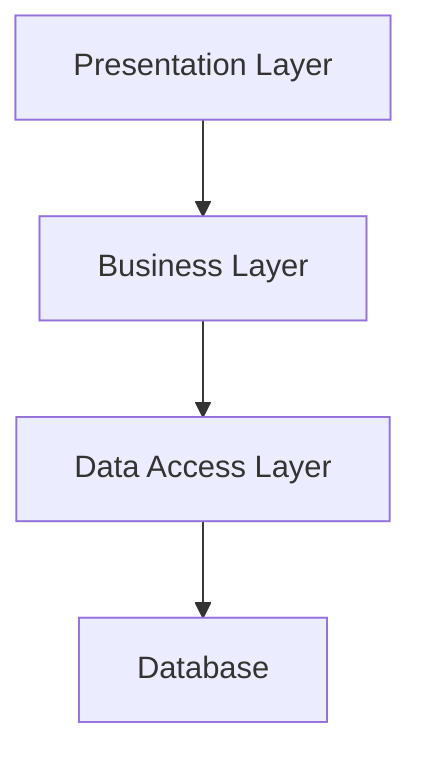
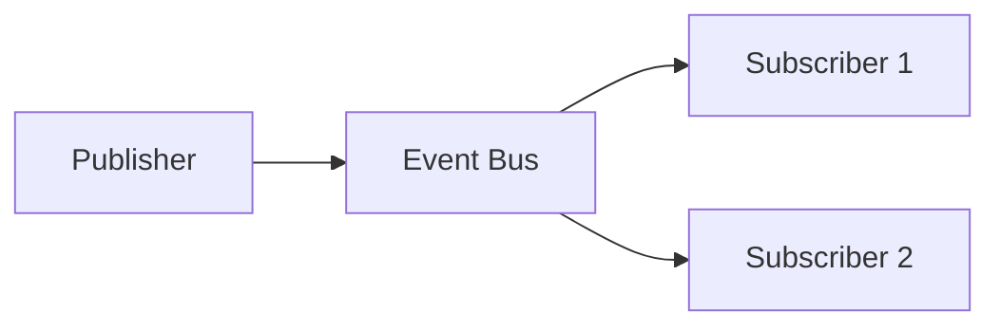

## Introduction

In modern software development, creating systems that can easily adapt to change and scale with demand is crucial. This guide provides a comprehensive approach to designing such systems, with practical examples and proven patterns.

## Core Principles

### 1. Loose Coupling
Components should have minimal knowledge of each other, enabling independent changes and scaling.

### 2. High Cohesion
Related functionality should be grouped together, making systems easier to understand and maintain.

### 3. Separation of Concerns
Each component should handle one specific aspect of the system.

## Architecture Patterns

### 1. Layered Architecture



#### Implementation Example:

```python
# Domain Layer
class User:
    def __init__(self, id: int, name: str):
        self.id = id
        self.name = name

# Repository Interface
class UserRepository(ABC):
    @abstractmethod
    async def get_by_id(self, id: int) -> Optional[User]:
        pass
    
    @abstractmethod
    async def save(self, user: User) -> User:
        pass

# Business Layer
class UserService:
    def __init__(self, repository: UserRepository):
        self._repository = repository

    async def get_user(self, id: int) -> Optional[User]:
        return await self._repository.get_by_id(id)
```

### 2. Event-Driven Architecture

Perfect for building scalable, loosely coupled systems.



#### Implementation Example:

```python
class EventBus:
    def __init__(self):
        self._subscribers = defaultdict(list)

    def subscribe(self, event_type: str, callback: Callable):
        self._subscribers[event_type].append(callback)

    async def publish(self, event_type: str, data: dict):
        if event_type in self._subscribers:
            tasks = [
                asyncio.create_task(callback(data))
                for callback in self._subscribers[event_type]
            ]
            await asyncio.gather(*tasks)

# Usage Example
async def main():
    bus = EventBus()
    
    async def order_handler(data):
        print(f"Processing order: {data}")
    
    bus.subscribe("order_created", order_handler)
    await bus.publish("order_created", {"order_id": 123})
```

## Performance Optimization

### 1. High-Performance Computing with C++

When performance is critical:

```cpp
template<typename T>
class ThreadSafeQueue {
private:
    mutable std::mutex mutex;
    std::queue<T> queue;
    std::condition_variable condition;

public:
    void push(T value) {
        std::lock_guard<std::mutex> lock(mutex);
        queue.push(std::move(value));
        condition.notify_one();
    }

    T pop() {
        std::unique_lock<std::mutex> lock(mutex);
        condition.wait(lock, [this] { return !queue.empty(); });
        T value = std::move(queue.front());
        queue.pop();
        return value;
    }
};
```

### 2. Parallel Processing with CUDA

For massive parallel computations:

```cuda
__global__ void parallel_process(float* input, float* output, int n) {
    int idx = blockIdx.x * blockDim.x + threadIdx.x;
    if (idx < n) {
        output[idx] = input[idx] * input[idx];  // Example computation
    }
}

class GPUProcessor {
private:
    float *d_input, *d_output;
    int size;

public:
    GPUProcessor(int n) : size(n) {
        cudaMalloc(&d_input, size * sizeof(float));
        cudaMalloc(&d_output, size * sizeof(float));
    }

    void process(float* input, float* output) {
        // Copy to GPU
        cudaMemcpy(d_input, input, size * sizeof(float), 
                  cudaMemcpyHostToDevice);
        
        // Process
        int block_size = 256;
        int num_blocks = (size + block_size - 1) / block_size;
        parallel_process<<<num_blocks, block_size>>>(
            d_input, d_output, size
        );
        
        // Copy back to CPU
        cudaMemcpy(output, d_output, size * sizeof(float), 
                  cudaMemcpyDeviceToHost);
    }
};
```

## Best Practices

### 1. Configuration Management

Always externalize configuration:

```python
class Config:
    def __init__(self):
        self.load_from_env()

    def load_from_env(self):
        self.db_url = os.getenv('DB_URL')
        self.api_key = os.getenv('API_KEY')
        self.max_connections = int(os.getenv('MAX_CONNECTIONS', '10'))
```

### 2. Error Handling

Implement robust error handling:

```python
class ServiceError(Exception):
    def __init__(self, message: str, code: int):
        self.message = message
        self.code = code
        super().__init__(self.message)

async def handle_request(request):
    try:
        result = await process_request(request)
        return {"status": "success", "data": result}
    except ServiceError as e:
        return {"status": "error", "code": e.code, "message": e.message}
    except Exception as e:
        return {"status": "error", "code": 500, "message": str(e)}
```
