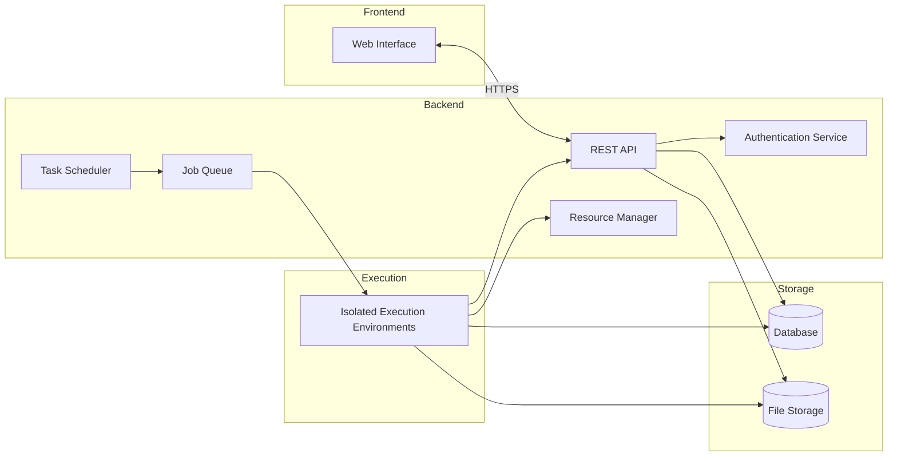

# Project Architecture and Implementation Plan

To build your platform for hosting and monetizing forecasting models, we'll design a modular, scalable architecture that leverages your existing skills and resources. Below is the overall architecture diagram, followed by detailed explanations of each component and a step-by-step implementation plan.

## Overall Architecture Diagram

## Component Breakdown

### 1. Frontend (Web Interface)

**Description:**

A user-friendly web interface for both Signal Providers and Subscribers to interact with the platform.

**Functions:**

*   **Signal Providers:**
    *   Login/Register
    *   Create, manage, and publish signals
    *   Access a code editor workspace
    *   View performance metrics
*   **Subscribers:**
    *   Browse available signals
    *   Subscribe to signals
    *   View signal performance
    *   Access predictions via UI or API keys

**Implementation:**

*   Use a web framework like React or Vue.js for dynamic UI.
*   Utilize AI coding assistants to generate front-end code.
*   Ensure responsive design for accessibility across devices.

### 2. Backend (REST API)

**Description:**

A RESTful API that handles all communication between the frontend and backend services.

**Functions:**

*   User authentication and authorization
*   Signal management (create, update, delete, publish)
*   Subscription management
*   Providing API endpoints for users to access data
*   Serving performance metrics and logs

**Implementation:**

*   Use FastAPI (since you have experience with it) for building the API.
*   Implement authentication using JWT tokens.
*   Ensure proper input validation and error handling.

### 3. Authentication Service

**Description:**

Handles user registration, login, and permission management.

**Functions:**

*   Secure storage of user credentials
*   Session management
*   Role-based access control (Signal Providers vs. Subscribers)

**Implementation:**

*   Utilize libraries like OAuth2 or JWT for authentication.
*   Store passwords securely using hashing (e.g., bcrypt).

### 4. Database

**Description:**

Stores all persistent data required by the platform.

**Functions:**

*   User data (profiles, credentials)
*   Signal metadata
*   Subscription details
*   Performance metrics
*   Historical predictions

**Implementation:**

*   Use PostgreSQL or MySQL for relational data.
*   Use Redis for caching frequent queries if necessary.

### 5. File Storage

**Description:**

Stores user-uploaded code, models, and any related files.

**Functions:**

*   Secure storage and retrieval of code files (`app.py`, `requirements.txt`)
*   Version control for signals

**Implementation:**

*   Use the local filesystem for initial development.
*   Organize files by user and signal IDs.
*   Implement proper permissions to prevent unauthorized access.

### 6. Task Scheduler

**Description:**

Schedules the execution of signals at specified intervals (e.g., hourly).

**Functions:**

*   Trigger signal execution jobs every hour
*   Manage execution times and intervals

**Implementation:**

*   Use Celery Beat or APScheduler for scheduling tasks.
*   Ensure tasks are executed in a timely manner.

### 7. Job Queue

**Description:**

Manages the execution queue for signal processing tasks.

**Functions:**

*   Queueing execution jobs
*   Prioritizing tasks based on resources
*   Handling retries and failures

**Implementation:**

*   Use Celery with a message broker like RabbitMQ or Redis.
*   Monitor queue depths and processing times.

### 8. Resource Manager

**Description:**

Allocates CPU/GPU resources to execution environments.

**Functions:**

*   Monitor available resources
*   Allocate resources to execution jobs
*   Scale resources as needed

**Implementation:**

*   Use Docker to containerize execution environments.
*   Manage containers using Docker Compose or Kubernetes for scalability.
*   Implement resource limits to prevent overuse.

### 9. Isolated Execution Environments

**Description:**

Runs the Signal Providers' code in isolation to ensure security and stability.

**Functions:**

*   Execute user code safely
*   Install specified dependencies
*   Prevent unauthorized access to the host system or internet

**Implementation:**

*   Use Docker containers to isolate the execution.
*   Each signal runs in its own container with specified Python version and dependencies.
*   Network policies to disable internet access, allowing only the database connection.

## Step-by-Step Implementation Plan

### Phase 1: Planning and Setup

*   **Define Requirements in Detail**
    *   List all features and functionalities.
    *   Prioritize features for an MVP (Minimum Viable Product).
*   **Set Up Development Environment**
    *   Install necessary tools (Python, Docker, PostgreSQL, etc.).
    *   Configure version control with Git.

### Phase 2: Backend Development

*   **Create the REST API with FastAPI**
    *   Set up the project structure.
    *   Implement authentication endpoints.
    *   Create endpoints for signal management.
    *   Develop subscription management endpoints.
*   **Implement the Database Schema**
    *   Design database models for users, signals, subscriptions, and performance data.
    *   Use SQLAlchemy or Tortoise ORM for object-relational mapping.
*   **Set Up Authentication Service**
    *   Implement user registration and login.
    *   Secure endpoints with proper authorization.

### Phase 3: Frontend Development

*   **Design the UI/UX**
    *   Sketch wireframes for key pages (dashboard, signal creation, browsing signals).
    *   Focus on intuitive navigation and usability.
*   **Develop the Frontend**
    *   Initialize a React or Vue.js project.
    *   Build components for login, dashboards, and signal management.
    *   Integrate frontend with backend API endpoints.
*   **Utilize AI Assistants**
    *   Leverage AI tools to expedite front-end coding.
    *   Ensure to review and test AI-generated code thoroughly.

### Phase 4: Execution Environment Setup

*   **Set Up Docker Environment**
    *   Create a base Docker image for the execution environment.
    *   Configure images for different Python versions as needed.
*   **Implement Code Upload and Storage**
    *   Allow Signal Providers to upload `app.py` and `requirements.txt`.
    *   Store files securely in the file system.
*   **Configure Isolated Execution**
    *   Write scripts to build Docker containers from user code.
    *   Ensure containers are isolated with no internet access.
    *   Map necessary volumes and environment variables.

### Phase 5: Task Scheduling and Execution

*   **Implement Task Scheduler**
    *   Set up Celery Beat or APScheduler to trigger jobs hourly.
*   **Set Up Job Queue with Celery**
    *   Configure Celery workers to execute tasks.
    *   Connect Celery to the message broker.
*   **Resource Management**
    *   Monitor resource utilization.
    *   Implement limits on CPU/GPU usage per container.

### Phase 6: Data Flow and API Design

*   **Design Data Access Methods**
    *   Create APIs for Signal Providers' code to access data securely.
    *   Implement query interfaces that provide necessary technical data.
*   **Ensure Secure Data Handling**
    *   Validate all data inputs and outputs.
    *   Sanitize data to prevent injection attacks.

### Phase 7: Performance Metrics and Monitoring

*   **Implement Logging**
    *   Collect logs from execution environments.
    *   Store logs for debugging and performance analysis.
*   **Build Performance Tracking**
    *   Record predictions and actual outcomes.
    *   Provide analytics for Signal Providers and Subscribers.

### Phase 8: Testing and Deployment

*   **Write Automated Tests**
    *   Unit tests for backend and frontend components.
    *   Integration tests for end-to-end workflows.
*   **Deploy on Local Machine**
    *   Use Docker Compose to manage services.
    *   Ensure all components communicate correctly.
*   **Load Testing**
    *   Simulate multiple users to test system performance.
    *   Optimize as necessary.

### Phase 9: Security and Compliance

*   **Conduct Security Audits**
    *   Review code for vulnerabilities.
    *   Implement HTTPS for all communications.
*   **Compliance Checks**
    *   Ensure data privacy regulations are followed.
    *   Establish terms of service and user agreements.

### Phase 10: Documentation and Launch

*   **Create User Guides**
    *   Write documentation for Signal Providers on how to use the platform.
    *   Provide API documentation for Subscribers.
*   **Feedback Mechanisms**
    *   Implement ways for users to report issues or suggest improvements.
*   **Go Live**
    *   Launch the platform to a small group of users.
    *   Monitor usage and iterate based on feedback.

## API Design and Execution Plan Clarity

### API Endpoints

*   **Authentication**
    *   `POST /api/register/` - User registration
    *   `POST /api/login/` - User login
    *   `GET /api/logout/` - User logout
*   **Signal Management**
    *   `GET /api/signals/` - List signals
    *   `POST /api/signals/` - Create a new signal
    *   `GET /api/signals/{id}/` - Retrieve a specific signal
    *   `PUT /api/signals/{id}/` - Update a signal
    *   `DELETE /api/signals/{id}/` - Delete a signal
    *   `POST /api/signals/{id}/publish/` - Publish a signal
*   **Subscription Management**
    *   `GET /api/subscriptions/` - List subscriptions
    *   `POST /api/subscriptions/` - Subscribe to a signal
    *   `DELETE /api/subscriptions/{id}/` - Unsubscribe from a signal
*   **Predictions Data**
    *   `GET /api/predictions/` - Get predictions for subscribed signals
    *   `GET /api/predictions/{signal_id}/` - Get predictions for a specific signal

### Execution Plan

*   **Modular Development:**
    *   Build each component as an independent module with clear interfaces. This allows you to replace or upgrade modules without affecting the entire system.
*   **API First Approach:**
    *   Design the APIs before implementing the frontend. This ensures that the frontend and backend are decoupled and can be developed simultaneously.
*   **Scalability Considerations:**
    *   Use Docker and Kubernetes (if needed) to orchestrate containers and manage resources.
    *   Design the database schema to handle growth.
    *   Implement caching strategies for frequent data access.
*   **Security Measures:**
    *   Enforce strong authentication and authorization checks.
    *   Sanitize all user inputs.
    *   Regularly update dependencies to patch vulnerabilities.
*   **Data Handling:**
    *   Ensure that Signal Providers' code cannot access unauthorized data.
    *   Implement data access layers with strict permissions.

## Hardware Requirements

### Development Machine:

*   **CPU:** Multi-core processor (e.g., 8 cores)
*   **RAM:** At least 16 GB
*   **Storage:** SSD with sufficient space (e.g., 500 GB)
*   **GPU:** If running models that require GPUs, consider a compatible GPU (e.g., NVIDIA RTX series)
*   **OS:** Linux (Ubuntu recommended)

### Production Environment:

*   Similar specs to the development machine but consider higher resources based on user load.
*   Ability to add more servers as containers via Docker Swarm or Kubernetes.

## Conclusion

By following this modular and scalable design, you'll create a solid foundation for your platform. Start small by focusing on core functionalities, and gradually add features as needed. Remember to continually test and gather user feedback to improve the platform iteratively.
