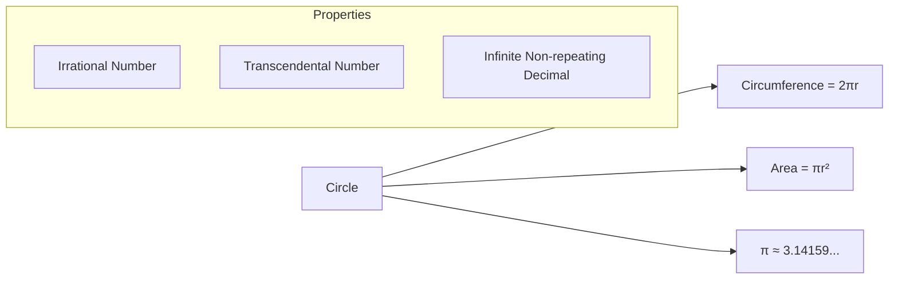
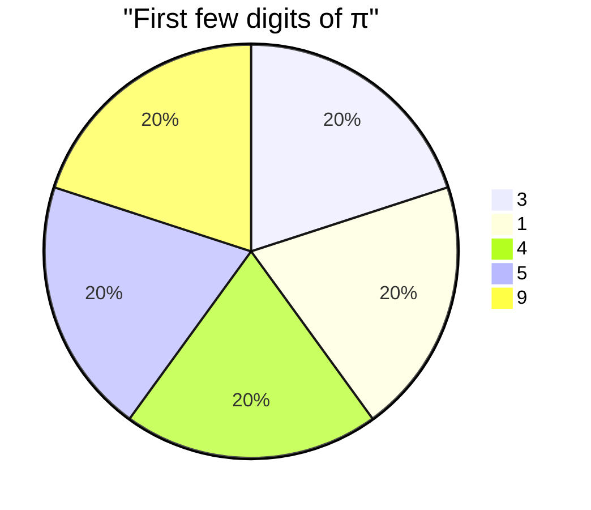
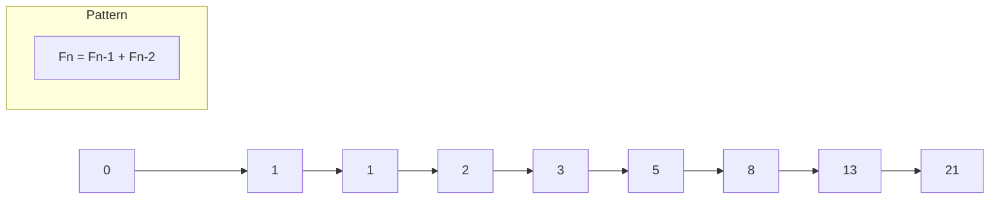
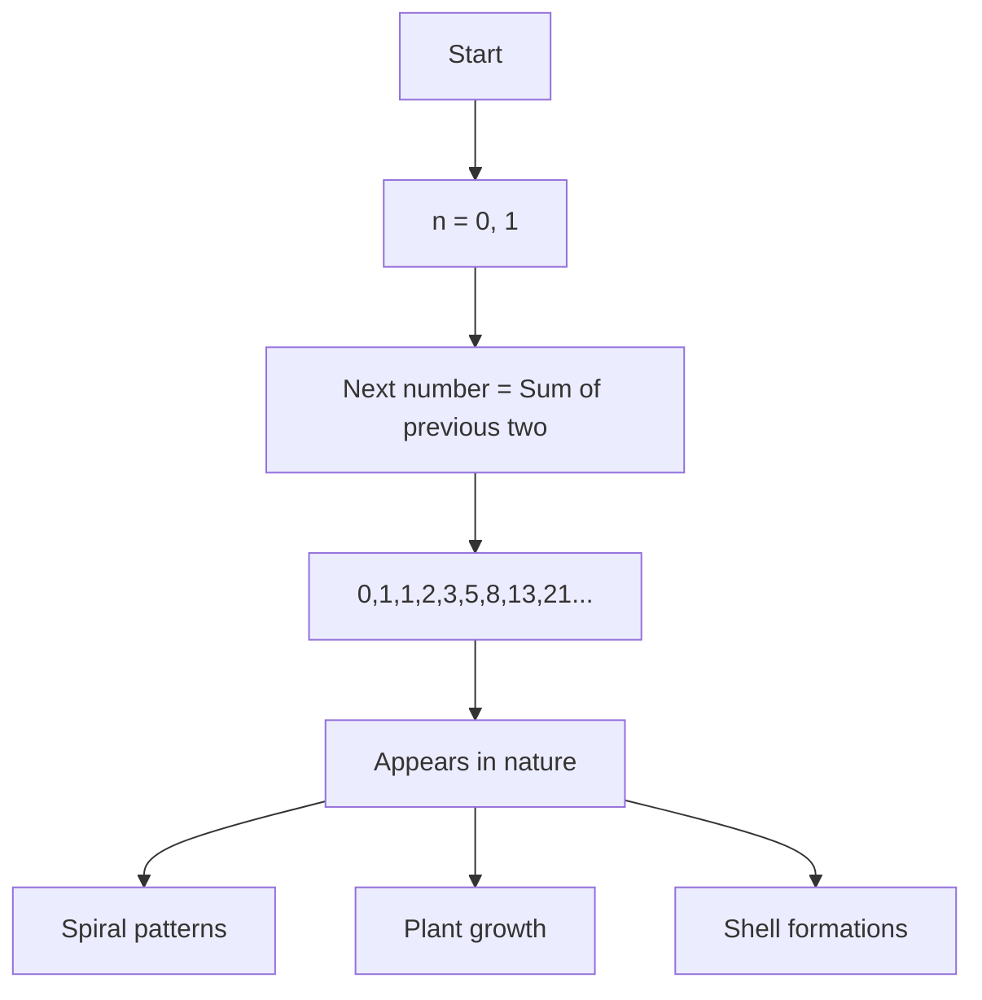
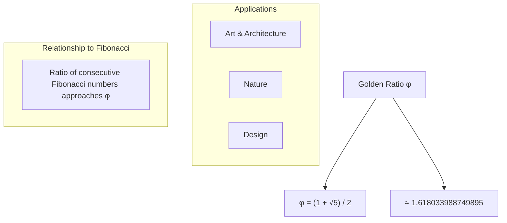
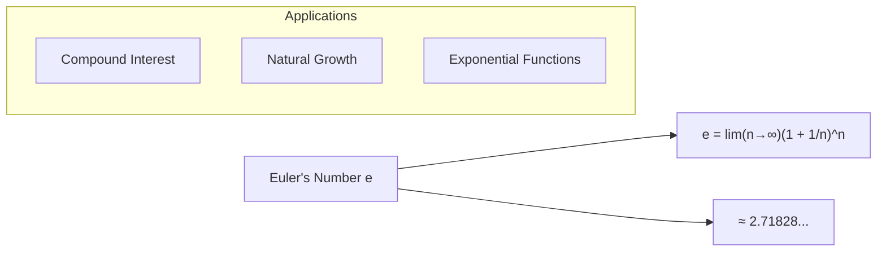
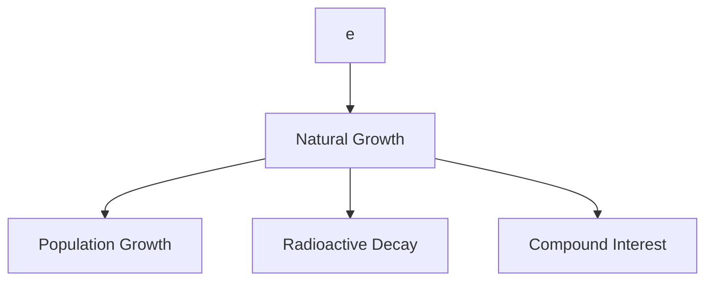
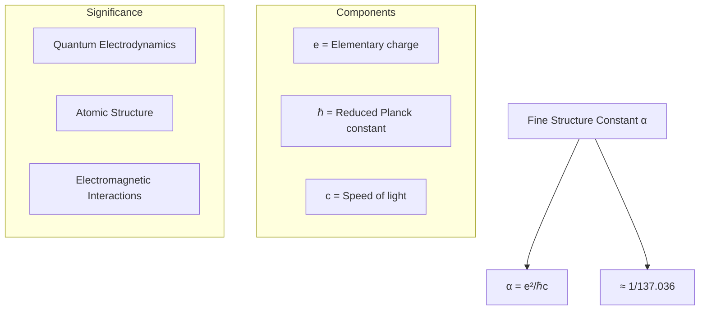

# Fundamental Mathematical Constants of the Universe

## Pi (π)
Pi is perhaps the most famous mathematical constant, representing the ratio of a circle's circumference to its diameter.

## Fibonacci Sequence
A sequence where each number is the sum of the two preceding ones, starting from 0 and 1.

## Golden Ratio (φ)
The golden ratio (approximately 1.618033988749895) is found by dividing a line into two parts where the longer part divided by the smaller part equals the whole length divided by the longer part.

## Euler's Number (e)
A fundamental mathematical constant approximately equal to 2.71828, basis of natural logarithms.

## Fine Structure Constant (α)
A fundamental physical constant characterizing the strength of the electromagnetic interaction.

